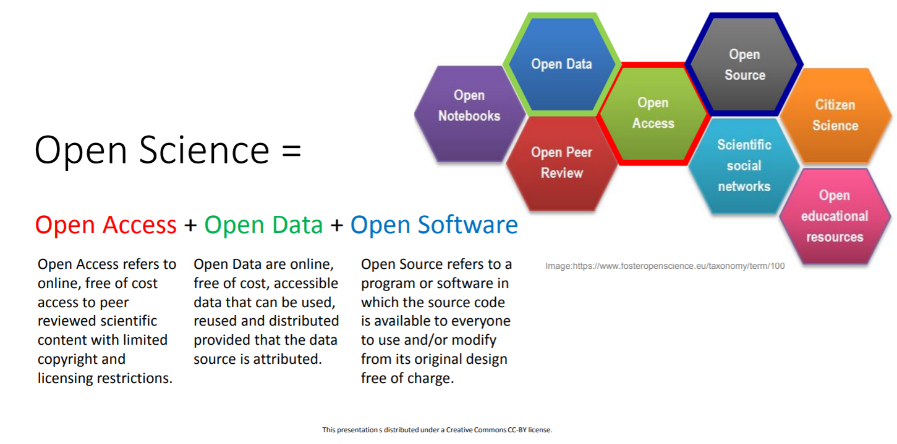
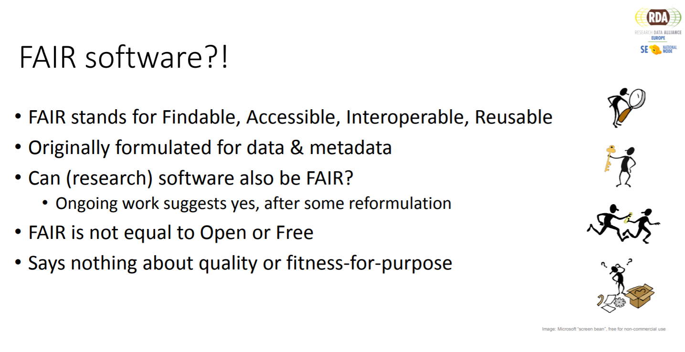

# Placing research software into Open Science

**Summary of the webinar organized by RDA Sweden on Friday 25th September 2020.**

*by Hamish Struthers and Anne Fouilloux (NICEST-2)*

- [Get the presentation slides from the webinar](https://snd.gu.se/sites/default/files/2020-09/RDA%20Sweden%20webinar%202020-09-25.pdf)
- [See video recording of the webinar](https://drive.google.com/file/d/1Nx3x8bZWd_3X8T3ZxPeWF_4eFjavEVie/view)

As part of [NICEST2](https://neic.no/nicest2) Workpackage 3 -  "FAIR climate data for NorESM and EC-Earth", we attended the webinar on "Placing research software into Open Science" that was organized by RDA Sweden. During the first part of the webinar, we got an overview of the joint activities between RDA Sweden and EOSC-Nordic and what has been achieved so far. During the second part of the seminar, a short presentation on RDA & EOSC-Nordic activities around FAIR software was given.

First the notion of Open Software was put into the more general context of Open Science. The figure below (taken from the presentation) summarizes well what has been introduced.

Then the differences between Open Software and FAIR software were detailed. To avoid any misunderstanding the notion of FAIR software was explained (as shown on the figure below). 

There were some discussions around the meaning of each FAIR letter (Findable, Accessible, Interoperable, Reusable) in the context of software. 
Confusion between repositories (github repositories and data repositories) were discussed too.
The bioinformatics community was highlighted as the one having made the most progress towards FAIR software even though there were still many pending issues. 

Overall, it was an interesting webinar that clarified a few misunderstanding (Open software versus FAIR software) and raised some interesting questions (what defines software: code, scripts, workflows?). For the climate community, our strategy to work towards two directions e.g. FAIR climate data (model outputs) and FAIR climate tools (software) seems to be well aligned with other initiatives.

